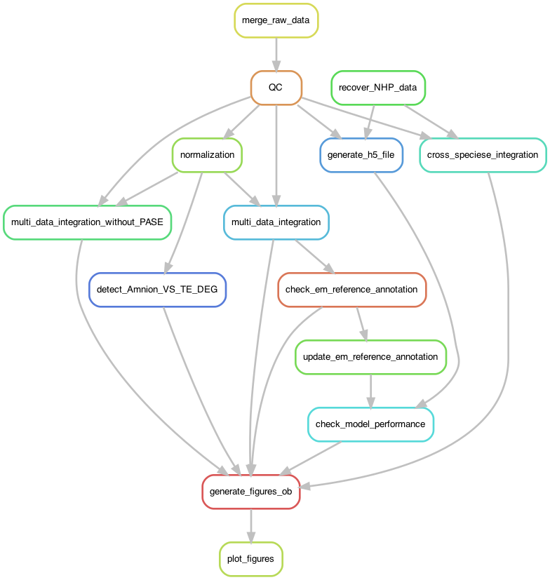

# Blastoid check

This repository contains the code used to check the Blastoids single-cell RNA-seq data

- Xiaodong Liu, Jia Ping Tan, Jan Schröder, Asma Aberkane, John F. Ouyang, Monika Mohenska, Sue Mei Lim, Yu B. Y. Sun, Joseph Chen, Guizhi Sun, Yichen Zhou, Daniel Poppe, Ryan Lister, Amander T. Clark, Owen J. L. Rackham, Jennifer Zenker# & Jose M. Polo&#. **Modelling human blastocysts by reprogramming fibroblasts into iBlastoids.** *Nature* (2021). https://doi.org/10.1038/s41586-021-03372-y.

- Leqian Yu\*, Yulei Wei\*, Jialei Duan\*, Daniel A. Schmitz, Masahiro Sakurai, Lei Wang, Kunhua Wang, Shuhua Zhao, Gary C. Hon# & Jun Wu#. **Blastocyst-like structures generated from human pluripotent stem cells.** *Nature* (2021). https://doi.org/10.1038/s41586-021-03356-y

- Ayaka Yanagida, Daniel Spindlow, Jennifer Nichols, Anish Dattani, Austin Smith # & Ge Guo#. **Naive stem cell blastocyst model captures human embryo lineage segregation.** *Cell Stem Cell* (2021). https://doi.org/10.1016/j.stem.2021.04.031

- Harunobu Kagawa\*, Alok Javali\*, Heidar Heidari Khoei\*, Theresa Maria Sommer, Giovanni Sestini, Maria Novatchkova, Yvonne Scholte op Reimer, Gaël Castel, Alexandre Bruneau, Nina Maenhoudt, Jenna Lammers, Sophie Loubersac, Thomas Freour, Hugo Vankelecom, Laurent David & Nicolas Rivron. **Human blastoids model blastocyst development and implantation.** *Nature* (2021). https://doi.org/10.1038/s41586-021-04267-8

***Analysis pipeline

